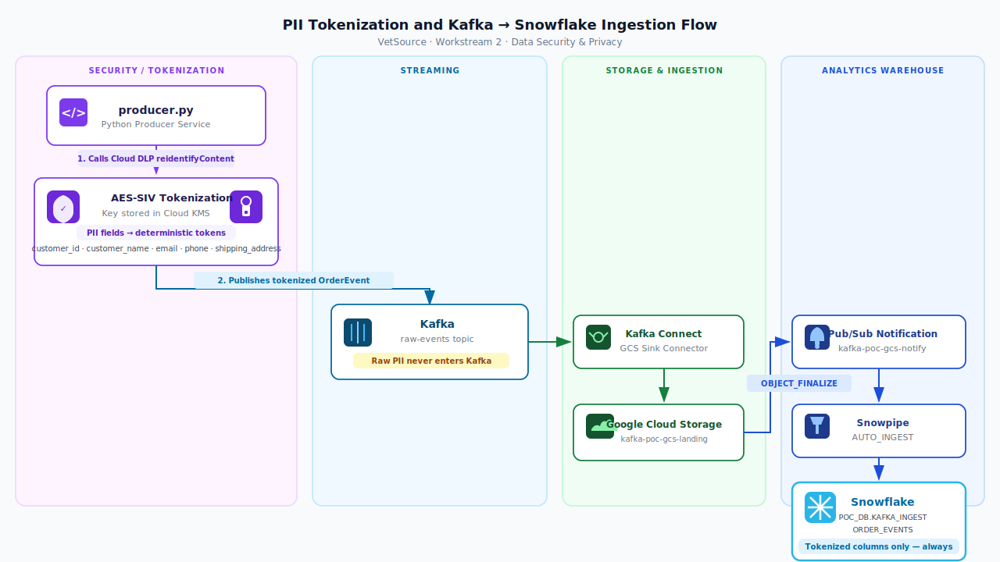
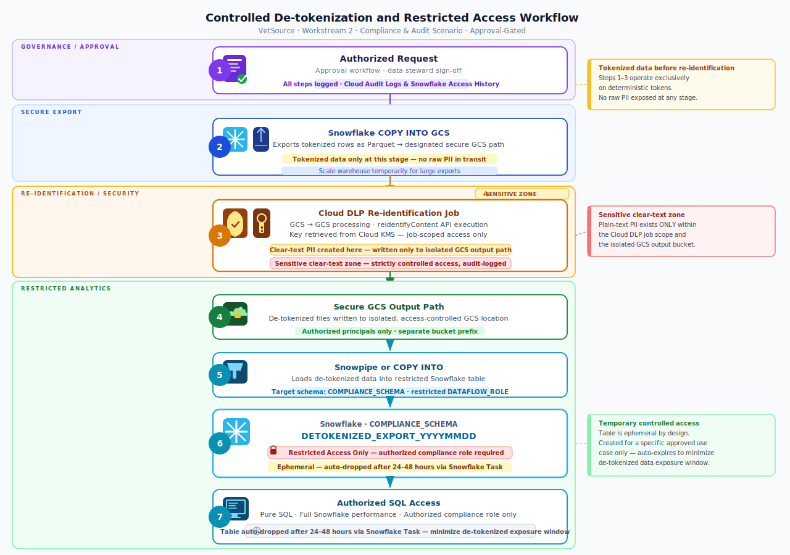

# De-tokenization Strategy for Snowflake
**VetSource · Workstream 2 · Data Security & Privacy**

---

## Tokenization Strategy Recommendation

**Recommended: Cloud DLP Deterministic Encryption (AES-SIV)**

| Strategy | Reversible | Consistent Token | Recommendation |
|---|:---:|:---:|---|
| One-way hash (SHA-256) | No | Yes | Reject — forecloses de-tokenization permanently |
| **Deterministic encryption (AES-SIV)** | **Yes** | **Yes** | **Recommended** |

Deterministic encryption produces the same token for the same input value — enabling joins and aggregations on tokenized data — while remaining fully reversible via Cloud DLP's `reidentifyContent` API using the key stored in **Cloud KMS**. The key never leaves KMS and is never embedded in application code.

**Fields tokenized at source before Kafka publish:**

| Field | Reason |
|---|---|
| `customer_id` | Links to pet owner identity |
| `customer_name` | Direct PII |
| `email` / `phone` | Contact PII |
| `shipping_address` | Location PII |
| `order_id`, `product_id`, `amount`, `status` | Not PII — pass through untouched |

---

## How the Pipeline Delivers Tokenized Data to Snowflake



Snowflake receives **only tokenized data at every point in the pipeline.** No stage — Kafka broker, GCS file, Snowpipe buffer — ever holds raw PII.

---

## De-tokenization: Two Controlled Access Patterns

### Pattern 1 — Row-Level Lookup (operational, low volume)
Snowflake External Function → Cloud DLP `reidentifyContent` API.
Suitable for: looking up a specific patient record, investigating a single order.
Not suitable for: bulk queries. Latency is ~50ms/batch; performance degrades at scale.

### Pattern 2 — Batch De-tokenization (compliance, audits, extraordinary scenarios)
Appropriate when an authorized team needs de-tokenized data for a specific, time-bound purpose.



Every step is logged in Cloud Audit Logs and Snowflake Access History. The de-tokenized table is **ephemeral by design** — it exists only for the duration of the approved use case.

---

## Can Millions of Rows Be Batch De-tokenized?

**Yes — Cloud DLP is designed for this scale.**

Cloud DLP's GCS-based de-identification jobs operate on files directly in object storage, bypassing API row limits. Throughput and timing estimates:

| Volume | Estimated File Size | Cloud DLP Job Duration |
|---|---|---|
| 100K rows | ~10 MB | < 1 minute |
| 1M rows | ~100 MB | 2–5 minutes |
| 10M rows | ~1 GB | 10–20 minutes |
| 100M rows | ~10 GB | 60–90 minutes |

There is **no hard row cap** on GCS-based DLP jobs. Google Cloud DLP processes petabyte-scale datasets in production environments. For VetSource's event volumes, even a full-history compliance export (tens of millions of rows) completes within a reasonable batch window.

**Key constraints to plan for:**
- Cloud DLP quota: 600 API requests/min (default); raiseable via GCP support
- Cloud KMS key access: IAM policy on the `reidentifyContent` role is the authorization gate
- Snowflake COPY INTO GCS: export speed is governed by warehouse size — scale up temporarily for large exports
- Approval latency is the dominant delay, not processing time

---

## Architecture Summary

```
Normal operations                 Extraordinary / compliance scenarios
──────────────────                ────────────────────────────────────
Tokenized data only               Batch de-tokenization job
in Kafka, GCS, Snowflake          (approval-gated, audited, time-limited)
                                  Millions of rows: ✓ feasible in minutes–hours
                                  Ephemeral restricted table, auto-expires
```

The streaming pipeline is unchanged regardless of de-tokenization scenario. De-tokenization is an **access control and batch processing problem**, not a pipeline problem.

---

*Document scope: Workstream 2 — Data Security & Privacy · VetSource Data Modernization POC*
